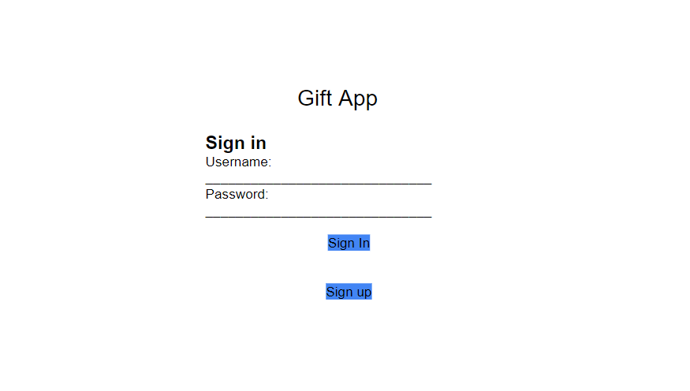
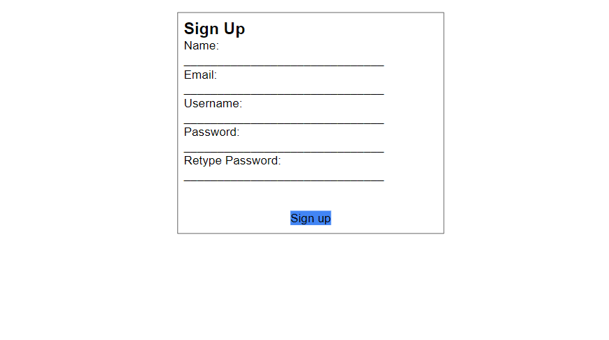
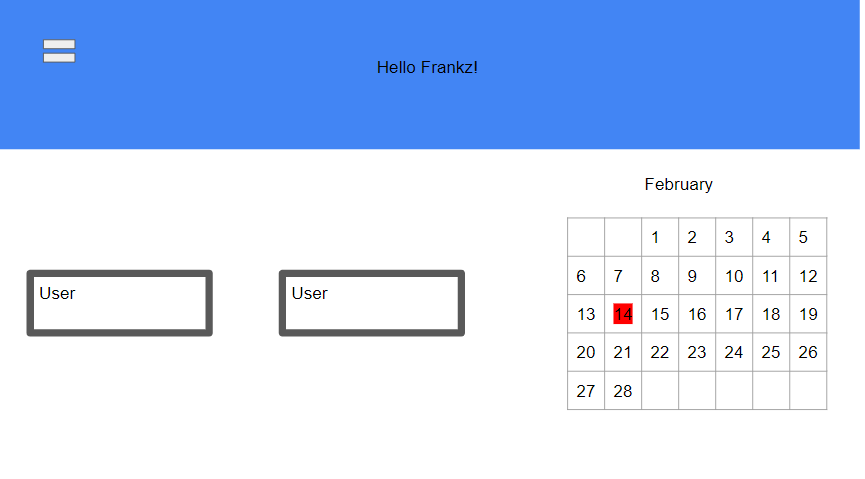
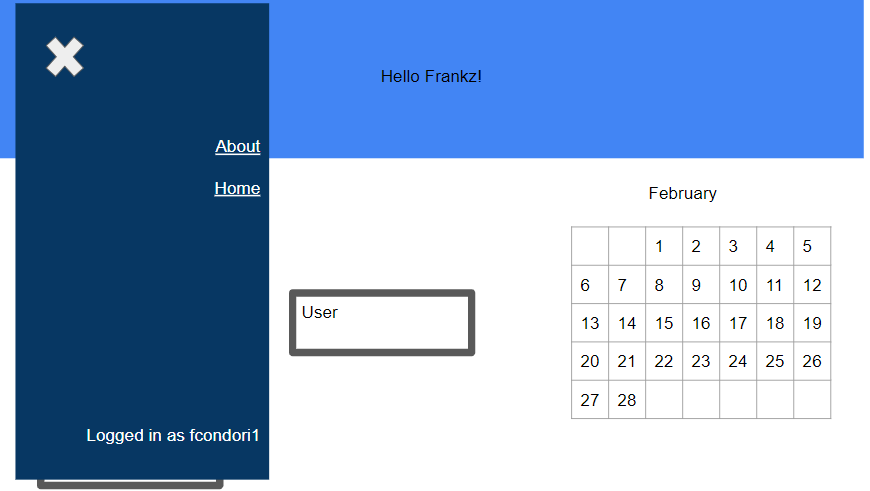
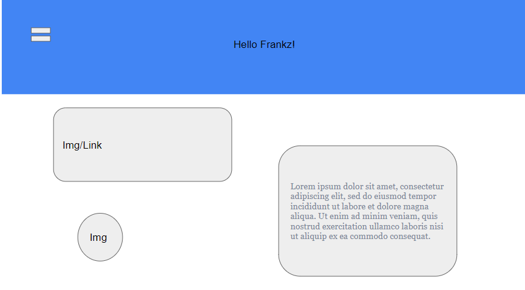

# Mygifts Frontend

https://my-gifts.netlify.app/

## Application Description

The application is called My-Gifts. It stems from the idea of always having to get asked what I want for christmas or my brirthday. Off the top of the head it isn't easy recalling different stuff I have seen online. Now with 'my-gifts' you can store stuff you have seen online and things you've always wanted on the app and send it to all your friends and family.

## Technologies Used

Javascript
CSS
HTML
React
React Calendar
React Router
React Icon
React Moment
React Bootstrap

## User Stories

As a user, I want to have my own account to log in
As a user, I want to see a gift profile
As a user, I want to it to be mobile friendly
As a user, I want to be able to send the link from my page

### Stretch goals

As a user, I want to be able to edit and delete profile information
As a user, I want to only see those profiles with a code of users I know
As a user, I want to be able to send people the links and profiles through an email
As a user I want to have a calendar that has upcoming holidays

### Installation

Open your terminal and navigate to your directory where you want to store the repository using cd 
On the GitHub repository, copy the "HTTPS" or "SSH" key.
On your terminal use git clone "SSH" or "HTTPS".
cd into the directory
run npm install to install dependencies
open in VScode using code .
to run the frontend locally, run npm start

### Wireframes

